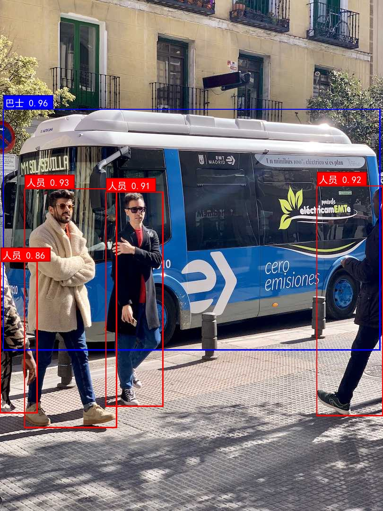

# 🚀 YOLOv11 Go 目标检测器（支持中文标签）

一个基于 **ONNX Runtime** 和 **YOLOv11** 的轻量级目标检测工具，使用 Go 语言编写，支持中文标签显示、多平台（Windows/macOS/Linux）。

 

## ✨ 特性

- 🖼️ 支持 JPG/PNG/GIF 输入
- 💡 自动识别中文字体，显示中文标签
- ⚡ 高性能推理（ONNX Runtime + GPU 可选）
- 🎨 彩色边界框 + 置信度标签
- 📦 跨平台（Windows / macOS / Linux）

## 🛠️ 快速开始

### 1. 安装 Go（≥1.20）
[https://go.dev/dl](https://go.dev/dl)

### 2. 克隆项目
```bash
git clone https://github.com/sdauma/yolo-go-detector.git
cd yolo-go-detector